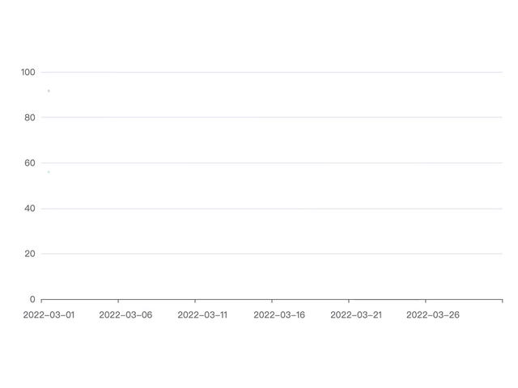

### 使用
npm install

npm run start


### 背景



期望用ECharts实现——鼠标可以进入图表的tooltip框，并点击其中的内容进行交互


**问题1**：tooltip会跟随光标移动，光标永远在tooltip框外

设置enterable属性，使鼠标可以进入tooltip
```
tooltip: {
  enterable: true
}
```

**问题2**：图表数据点超多，点与点之间很紧密，即使设置了可以进入tooltip，但移动鼠标后，还没进入，tooltip就飘到下一个点上了，永远追不到

将tooltip紧贴鼠标，使鼠标能够轻松进入框内

```js
tooltip: {
    position: function (point, params, dom, rect, size) {
      // 提示框位置
      let x, y
      // 当前鼠标位置
      const pointX = point[0]
      const pointY = point[1]
      // 提示框尺寸
      const boxWidth = size.contentSize[0]
      const boxHeight = size.contentSize[1]
      // 容器尺寸
      const viewWidth = size.viewSize[0]
      // const viewHeight = size.viewSize[1]
      // 设置光标左右位置
      if (viewWidth - boxWidth < pointX) {
        // 光标位置 大于 容器减去提示框的位置，右边放不下，放在左侧
        x = pointX - boxWidth
      } else {
        // 默认紧贴光标右侧显示
        x = pointX
      }
      // 设置光标上下位置
      if (boxHeight < pointY) {
        // 光标位置 小于 提示框位置，上面放不下，放在下侧
        y = pointY - boxHeight
      } else {
        // 默认紧贴光标上侧显示
        y = pointY
      }
      // 记录提示框位置
      // if (window.tooltipSpace?.position) window.tooltipSpace.position = [x, y]
      return [x, y]
    }
}
```

**问题3**：tooltip过长，超出容器被截断

confine, appendTo, appendToBody等方法在部分情况下都没有用，这里产生的问题归根结底还是tooltip被置入了chart这个元素下，但是其父级设置了overflow: hidden; 而产生的问题，如果其他方法都不生效，可以改动各元素的overflow来解决


**问题4**：tooltip的formatter使用模版字面量，如何良好的进行交互？

将需要调用的函数绑定在window上，并在挂载和卸载时分别设置和删除（本例基于react）

```js

// formatter中的模版字面量
// `<div onclick="window.tooltipSpace.expandList(${dataIndex}, ${index})">More</div>`

// useTooltip.js
// 通用内容提取在该文件中
function useTooltip(list) {
  useEffect(() => {
    if (!window.tooltipSpace) {
      window.tooltipSpace = {}
    }
    for (const key in list) {
      window.tooltipSpace[key] = list[key]
    }
    return () => {
      delete window.tooltipSpace
    }
  }, [])
  // return { ... }
}

// app.js
// 在页面上使用
useTooltip({
  expandList: expandList,
  // data: Array(30).fill({ status: -1 }),
  // lastDataIndex: -1
})
function expandList() {}

```

**问题5**：在tooltip上交互后，其上的内容不会自动渲染（点击后没有变化）

调用ECharts的dispatchAction使tooltip先消失再显示，实现自动渲染

```js
export const updateTooltip = (dataIndex: number, chart) => {
  // 先消失后显示，以此实现数据更新
  chart.dispatchAction({
    type: 'hideTip',
    seriesIndex: 0,
    dataIndex // 第几个节点的tooltip
  })
  chart.dispatchAction({
    type: 'showTip',
    seriesIndex: 0,
    position: window.tooltipSpace?.position,
    dataIndex
  })
}
```

